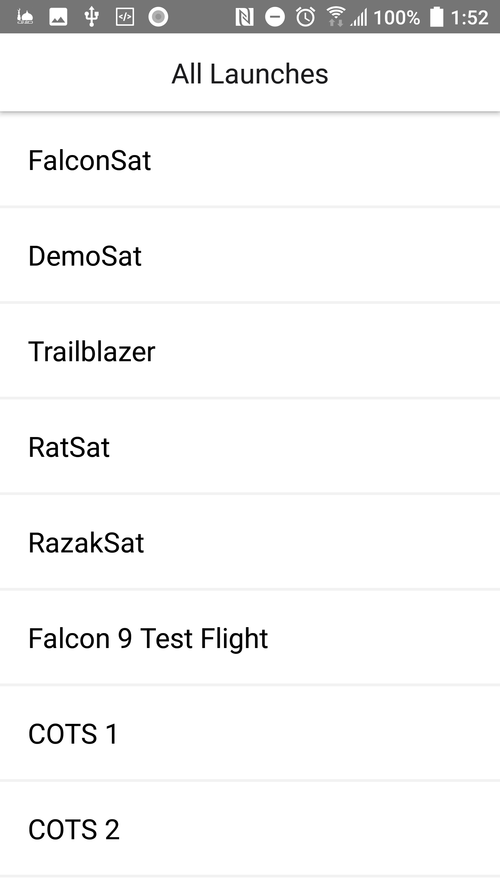

`Here is the all launch list and details page`

 # Technologies I have used
React-native, redux, redux-saga, axios , react-navigation.

First install node_modules by

### `yarn install`

Then run the app by following command
### `npx react-native run-android`

Please see the `screenshot` to see the view

